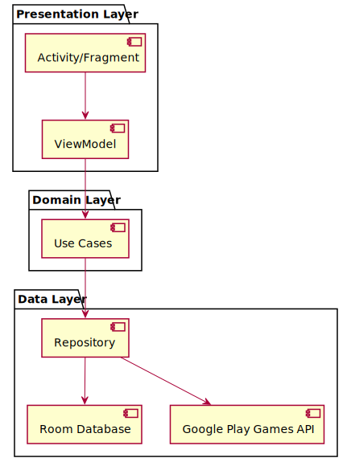
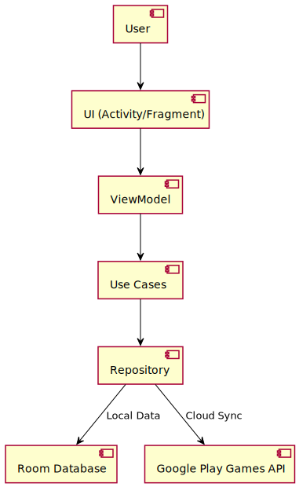
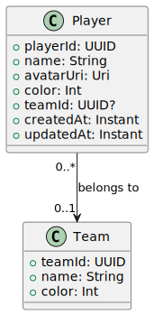
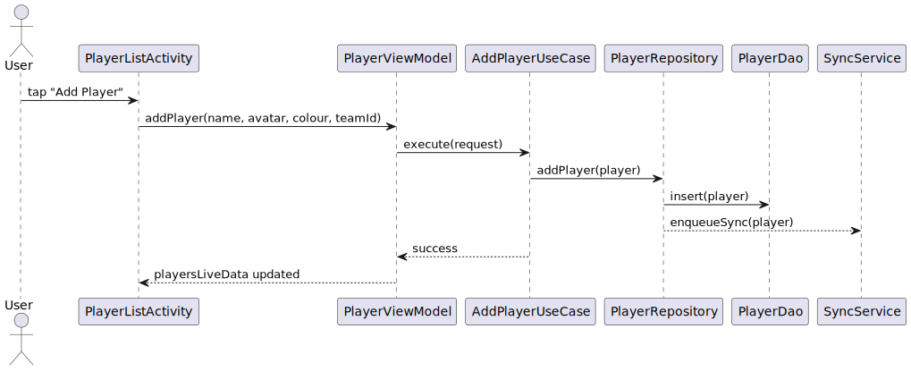
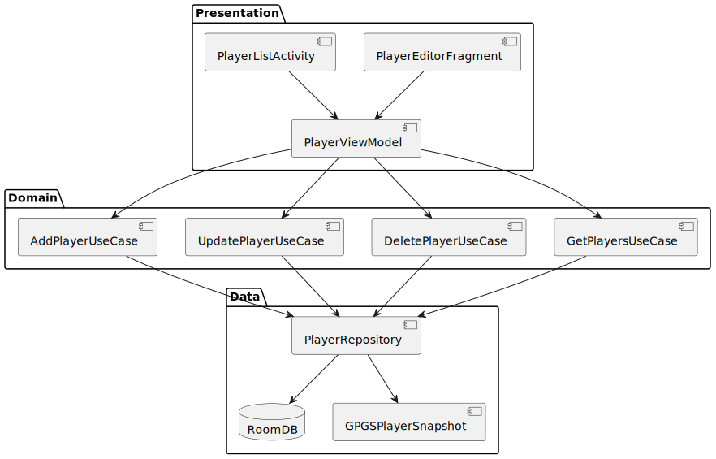
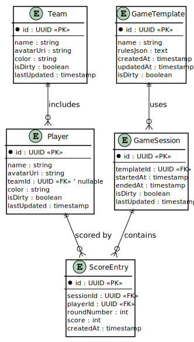
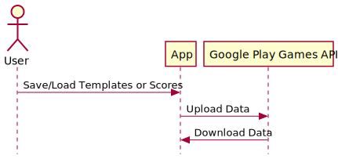

# Architecture Document for Scoreboard Buddy

---

## 1 · Overview

The architecture for Scoreboard Buddy is designed to support an offline-first Android application with cloud synchronization, template management, and scoring functionality. The system follows the MVVM (Model-View-ViewModel) architecture pattern to ensure separation of concerns and scalability.

---

## 2 · High-Level Architecture

The application is divided into the following layers:

1. **Presentation Layer**: Handles UI and user interactions.
2. **Domain Layer**: Contains business logic and use cases.
3. **Data Layer**: Manages data persistence and cloud synchronization.

### High-Level Architecture Diagram

---

## 3 · Component Details

### 3.1 Presentation Layer

- **Activities/Fragments**: Responsible for rendering UI and handling user input.
- **ViewModels**: Expose data to the UI and handle state management.

### 3.2 Domain Layer

- **Use Cases**: Encapsulate business logic, such as creating templates, importing/exporting templates, and managing scores.

### 3.3 Data Layer

- **Repository**: Acts as a single source of truth, mediating between the domain layer and data sources.
- **Room Database**: Stores local data, including game templates and scores.
- **Google Play Games API**: Handles cloud synchronization for templates and scores.

---

## 4 · Data Flow

### Data Flow Diagram

---

## 5 · Key Features and Modules

### 5.1 Template Management

- **Create Templates**: Users can define custom scoring rules.
- **Import/Export Templates**: JSON-based file handling for sharing templates.

### 5.2 Scoring System

- **Score Entry**: Per-turn/round score entry with undo functionality.
- **Score History**: View round-by-round breakdown and progression graphs.

### 5.3 Cloud Synchronization

- **Google Play Games Saved Games**: Sync templates and scores across devices.

### 5.4 Player Management (**RF_1**)

> *Add / edit / remove **players** and **teams**; assign colours, avatars, and optional grouping so that games can be scored accurately.*

#### 5.4.1 Responsibilities

- **Create Player / Team** – Persist new players or teams locally, enqueue cloud sync.
- **Edit Player / Team** – Update names, colours, avatars; propagate changes to ongoing games.
- **Delete Player / Team** – Cascade rules to maintain referential integrity (e.g., orphan scores reassigned or removed).
- **List & Select** – Paginated list with search and colour/initial avatar chips for quick selection when starting a new game.

#### 5.4.2 Architectural Placement

- **Presentation Layer**
  - `PlayerListActivity`, `PlayerEditorFragment`
- **ViewModel Layer**
  - `PlayerViewModel` (exposes `LiveData<List<PlayerWithTeam>>`)
- **Domain Layer**
  - `AddPlayerUseCase`, `UpdatePlayerUseCase`, `DeletePlayerUseCase`, `GetPlayersUseCase`
- **Data Layer**
  - `PlayerRepository` → orchestrates between `Room` and cloud sync (`GpgsSnapshotDataSource`)
  - DAOs: `PlayerDao`, `TeamDao`

#### 5.4.3 Player Management Data Model

#### 5.4.3 Sequence Add Player

#### 5.4.4 Component Diagram

#### 5.4.6 Offline-First and Sync

- All operations are local-first.
- Entities are marked isDirty = true and synced in the background.
- Conflict resolution: last-write-wins using updatedAt timestamp.
- Manual conflict merge UI may be added in future releases (see RF_10).

---

## 6 · Database Schema

### 6.1 Full Database Schema

The following diagram shows the full data model including:

- Core game entities
- Player and team management
- User settings
- Offline-first sync metadata

This is detailed in the following sections.

### 6.2 Player & Team Management
#### 6.2.1 Database Considerations

- Entities: players, teams tables in Room.
- Indices: Composite index on (teamId, name) for faster team-scoped look-ups.
- Migrations: E.g., Migration_1_2 creates tables and backfills solo players to default team.
- Referential Integrity: ON DELETE SET NULL for teamId to preserve score history.

### 6.2.2 Player & Team Management Schema

To support flexible team-based and solo gameplay, the following data model has been implemented for player management.

- Players are assigned to teams, but the team ID can be null (solo mode).
- Avatars are stored as references to assets or URI strings.
- Each entity tracks a `lastUpdated` timestamp and `isDirty` flag to support offline-first sync.

#### 6.2.3 Tables

- **Player**
  - `id` (PK)
  - `name`
  - `avatarUri`
  - `teamId` (FK → Team.id, nullable)
  - `color`
  - `isDirty`
  - `lastUpdated`

- **Team**
  - `id` (PK)
  - `name`
  - `color`
  - `avatarUri`
  - `isDirty`
  - `lastUpdated`

---

## 7 · Cloud Sync Workflow

### Cloud Sync Diagram

---

## 8 · Risks and Mitigations

| Risk                                    | Mitigation                                                    |
|-----------------------------------------|---------------------------------------------------------------|
| Invalid/corrupted template imports      | Validate JSON schema; show descriptive errors to users        |
| Conflicting templates across devices    | Use timestamps; prompt user to choose which version to keep   |

---

## 9 · Conclusion

This architecture ensures a modular, scalable, and maintainable design for Scoreboard Buddy, supporting offline-first functionality, cloud synchronization, and a seamless user experience.

