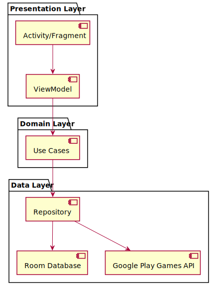
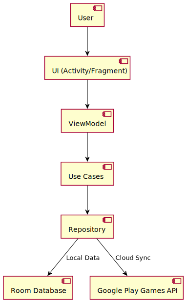
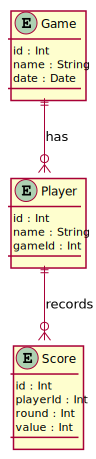
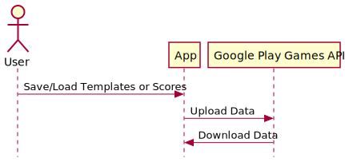

# Architecture Document for Scoreboard Buddy

---

## 1 · Overview

The architecture for Scoreboard Buddy is designed to support an offline-first Android application with cloud synchronization, template management, and scoring functionality. The system follows the MVVM (Model-View-ViewModel) architecture pattern to ensure separation of concerns and scalability.

---

## 2 · High-Level Architecture

The application is divided into the following layers:

1. **Presentation Layer**: Handles UI and user interactions.
2. **Domain Layer**: Contains business logic and use cases.
3. **Data Layer**: Manages data persistence and cloud synchronization.

### High-Level Architecture Diagram

---

## 3 · Component Details

### 3.1 Presentation Layer

- **Activities/Fragments**: Responsible for rendering UI and handling user input.
- **ViewModels**: Expose data to the UI and handle state management.

### 3.2 Domain Layer

- **Use Cases**: Encapsulate business logic, such as creating templates, importing/exporting templates, and managing scores.

### 3.3 Data Layer

- **Repository**: Acts as a single source of truth, mediating between the domain layer and data sources.
- **Room Database**: Stores local data, including game templates and scores.
- **Google Play Games API**: Handles cloud synchronization for templates and scores.

---

## 4 · Data Flow

### Data Flow Diagram

---

## 5 · Key Features and Modules

### 5.1 Template Management

- **Create Templates**: Users can define custom scoring rules.
- **Import/Export Templates**: JSON-based file handling for sharing templates.

### 5.2 Scoring System

- **Score Entry**: Per-turn/round score entry with undo functionality.
- **Score History**: View round-by-round breakdown and progression graphs.

### 5.3 Cloud Synchronization

- **Google Play Games Saved Games**: Sync templates and scores across devices.

---

## 6 · Database Schema

### Database Schema Diagram

---

## 7 · Cloud Sync Workflow

### Cloud Sync Diagram

---

## 8 · Risks and Mitigations

| Risk                                    | Mitigation                                                    |
|-----------------------------------------|---------------------------------------------------------------|
| Invalid/corrupted template imports      | Validate JSON schema; show descriptive errors to users        |
| Conflicting templates across devices    | Use timestamps; prompt user to choose which version to keep   |

---

## 9 · Conclusion

This architecture ensures a modular, scalable, and maintainable design for Scoreboard Buddy, supporting offline-first functionality, cloud synchronization, and a seamless user experience.

